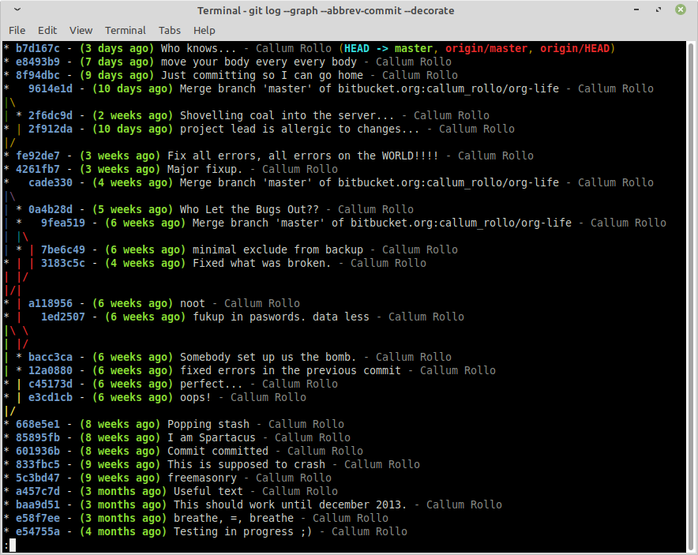

Title: Shell games
Date: 2020-10-02 18:20
Modified: 2020-10-02 18:20
Category: FOSS
Tags:  linux, bash, software, optimise
Slug: bash
Summary: Excerpts from my .bashrc and shell scripts

### First off, what's a shell?

The shell is how you, mighty keyboard warrior, maintain control over the awe-inspiring power of your [unix system](https://www.youtube.com/watch?v=SpLRTAGa6bU)*.  Here I have collected some of my favourite one liners, aliases and shell scripts that I use to reduce repetitive typing, quickly analyse data, improve my writing and more.

*If you're not already on some flavour of unix, check out [this guide](http://matt.might.net/articles/basic-unix/) to get up to speed. It's way more fun than you might think, I promise.

For the purpose of this article the **command line/shell/bash** all refer to the same thing. Namely, that little black box you summon with ctrl + alt + T that makes you feel like a badass 90s cyberpunk in wrap around shades who's about to hack the mainframe. Mine looks like this


Yours may differ, but as long as tying `ls` in it returns a list of directories, you should be good to go. Check out the link to [Matt Might's page](http://matt.might.net/articles/basic-unix/) above for a nice intro to the shell.

A **one liner** is a command that is one line long
An **alias** is a short name you give to a longer command, like a nickname for your favourite code snippets. You can make one right now like this:


Now your coputer can cheerfully greet you with the time of day in 4 keystrokes, neat huh?

A **shell script** is a series of instructions to be executed by your shell. This can range from a one liner, to sprawling programs. The advantage of writing shell scripts rather than, say Python scripts, is that any \*nix system you use will have a shell and some core utilities. No need to install dependencies. For this reason shell scripts are *portable*, never leave the house without them! (If when you read this we are still experiencing a global pandemic, maybe don't leave the house at all if you can avoid it.)

Now we've covered the terminology, on to the good stuff.

### My favourite aliases

Some of these are original thoughts, many are adapted from examples I've found in various corners of the internet. Using these functions can boost your productivity, increase your net worth and make you more significantly more attractive [[1](https://xkcd.com/285/)][[2](https://xkcd.com/462)]

- `..='cd ..'`
- `please='sudo'`
- `duh='du -h --max-depth=1'`
- `gcb='git checkout -b'` and a whole lot of other git shortcuts
- `gdiff=" git diff --word-diff"` check what changes you have staged in a file
- `hpc='ssh -XY username@uni.hpc.server`
- `nb='jupyter notebook'`
- `space='du -hS | sort -n -r |more'` to find what's using most space in a directory
- `wet='curl http://v2.wttr.in/Norwich'` why visit a weather site when you can find out form the command line why it's not worth leaving the house today?
- `aliasg='alias | grep'` for when I forget what I called my aliases
- ` set -o vi` vim keybindings in shell. **Only use if you love vim**. emacs users can try [this](https://youtu.be/dQw4w9WgXcQ?t=43) instead.

You can create an alias straight from the terminal as I did with `gday`

`alias please='sudo'`

Note the quote marks and lack of spaces round the `=`, these are not  optional.

Aliases created in such a way will only last through your terminal session. To persist aliases, they must be copied into your shell's `rc` file. This will be located in your home directory and typically hidden. For me it is `/home/callum/.zshrc`. Simply copy the aliases to the end of your `rc` file.

You can also set up slightly more complicated commands in the `rc` file like so

```
mcd () {
    mkdir -p $1
    cd $1
}
```

This command makes a directory then moves you into it. Try out `mcd test` then `ls` to check where you are

```
com () {
    git add -A
    git commit -m "$1"
    git push
}
```

This will add all files to the staging area, set a commit message of your choice and push upstream. Usage: `com "never push to master on Friday my dudes"`

If you can't think of a useful git commit message, fear not [whatthecommit](https://github.com/lwe/whatthecommit) has you covered. Try out my favourite alias `yolo`

`yolo='git add -A && git commit -m "$(curl --silent --fail http://whatthecommit.com/index.txt)" && git push'`

After building up a suitably useful/infuriating series of commit messages, you can make a pretty git commit tree to admire them [credit](https://stackoverflow.com/questions/1838873/visualizing-branch-topology-in-git/34467298#34467298)
  `lg="git log --graph --abbrev-commit --decorate --format=format:'%C(bold blue)%h%C(reset) - %C(bold green)(%ar)%C(reset) %C(white)%s%C(reset) %C(dim white)- %an%C(reset)%C(auto)%d%C(reset)'"`



### Ugly but useful shell scripts

These have saved me many hours of tedious manual tasks. Though I think some more time to write than they have yet saved me...

Use [ffmpeg](https://ffmpeg.org/) to apply fade in and out to a bunch of mp3 files

``` 
#!/bin/bash
for i in *.mp3; do
    ffmpeg -i "$i" -filter_complex "afade=d=0.5, areverse, afade=d=0.5, areverse" "`basename "$i" .mp3`f.mp3"
done
```

For clipping a dataset of interest from a larger geographical dataset before plotting. Requires [gdal](https://gdal.org/) library.
```
#! /bin/bash
# 
ogr2ogr -f "ESRI Shapefile" hidf_land.shp /media/callum/storage/Documents/global_datasets/osm_land/land_polygons.shp -clipsrc $1 $2 $3 $4
# four numbers at end are western bound southern bound eastern bound and northern bound in degrees. Longitude is from -180 to 180
```

Move your mouse every 30 seconds to prevent sleep mode. Inspired by [xkcd](https://xkcd.com/196/)
```
#!/bin/bash
while [ 1 ]; do
  xdotool mousemove 300 250
  sleep 30
  xdotool mousemove 300 850
  sleep 30
done
```

Use [imagemagick](https://imagemagick.org/index.php) to crop and animate a bunch of figures into a gif. Written the night before a conference, don't judge me!
```
#/bin/bash

for i in bar*.png
do
num=${i: 3:3}

filen="clip$num.png"
filen2="crop$num.png"
convert $i -trim +repage $filen
convert -crop -800-300 $filen $filen2
done
convert -delay 20 -loop 1 crop*.png animation.gif
echo foo
convert animation.gif  -trim +repage ani.gif
```

More imagemagick to make tight figuures (rmeove all whitespace from edges)

```
#!/bin/bash

rsync --recursive --filter="-! */" figures figures_crop

shopt -s extglob nullglob globstar
for file in figures/**/*.png
do
    echo $file
    convert $file -trim +repage "figures_crop/$file"
done
```

Get altimeter data from Seaglider log files
```
#!/bin/bash
# if directory not passed, use working directory
_dir="${1:-${PWD}}"

# Die if given a bad directory path
[ ! -d "$_dir" ] && { echo "Error: Directory $_dir not found."; exit 2; }

> alti.txt


printf "dive_no,altim_ping_depth,altim_bottom_ping,bottom_dist" >> alti.txt

for i in $1/*.log; do
    echo $i
    awk -F, '$1 == "$DIVE" {printf "\n" ; printf $2}' $i >> alti.txt
    awk -F, '$1 == "$ALTIM_PING_DEPTH" {$2=","$2; printf $2}' $i >> alti.txt
    awk -F, '$1 == "$ALTIM_BOTTOM_PING" {$2=","$2","; printf $2 $3}' $i >> alti.txt
done
```

Get voltage minima from Seaglider logs
```
#!/bin/bash
# if directory not passed, use working directory
_dir="${1:-${PWD}}"

# Die if given a bad directory path
[ ! -d "$_dir" ] && { echo "Error: Directory $_dir not found."; exit 2; }

# Make a blank text file
> min_v.txt

# Print row names
printf "dive_no,min_10V,min_24V" >> min_v.txt

# Search the log files for minimum voltages of both batteries
for i in $_dir/p*.log; do

    num=${i: -8:4}
    printf "\n$num" >> min_v.txt
    #awk -F, '$1 == "$10V_AH" {printf "\n" ; printf $2}' $i >> min_v.txt
    awk -F, '$1 == "$10V_AH" {$2=","$2; printf $2}' $i >> min_v.txt
    awk -F, '$1 == "$24V_AH" {$2=","$2; printf $2}' $i >> min_v.txt
done

# Remove rows with less than three values (typically dive 0000)
awk -F , 'NF>=3' min_v.txt >> min_volts.txt
```


### Scripts shamelessly copied from other, wiser people

[3 shell scripts to improve your writing, or "My Ph.D. advisor rewrote himself in bash."](http://matt.might.net/articles/shell-scripts-for-passive-voice-weasel-words-duplicates/)

I think these are great, so I've archived a version [here](../images/might-scripts.html)

----------------------
 [1] (https://xkcd.com/285/)
 [2] (https://xkcd.com/462)