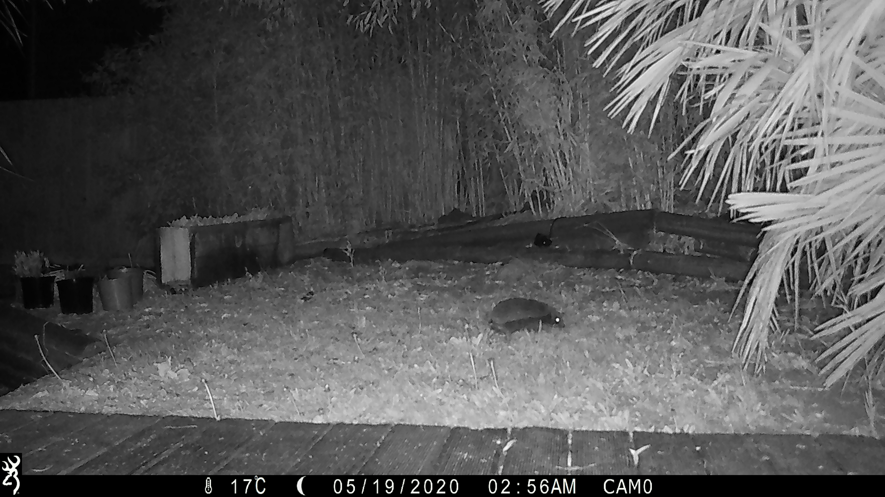

Title: Garden trailcam videos
Date: 2020-08-11 11:30
Modified: 2020-08-11 11:30
Category: Trailcam
Tags: trailcam, nature, non-work
Slug: trailcam
Summary: Some trailcam captures from my back garden in Norwich
Status: published
### Hedegehogs frequented the garden of my shared house in west Norwich

I noticed that they would run along the low walls of the garden and try to climb them, without succes. So, I installed some hi-tech hedgehog steps (3 bricks and an old plant basket).

<iframe src="https://player.vimeo.com/video/446786291" width="640" height="360" frameborder="0" allow="autoplay; fullscreen" allowfullscreen></iframe>

These steps rapidly became popular with the local hedgehogs, including some hoglets born that spring.

<iframe src="https://player.vimeo.com/video/446786252" width="640" height="360" frameborder="0" allow="autoplay; fullscreen" allowfullscreen></iframe>

I have found camera trapping with a motion-detector trailcam to be very rewarding. It is a non-invasive method for monitoring nature and suits people like me who do not have the patience to sit in hides with a telephoto lens for extended periods of time.

Several of the clips have been uploaded to [mammalweb](https://www.mammalweb.org/index.php/en/) for citizen science purposes. At the time of writing, this is the only trailcam site in Norwich.

These videos were edited together (poorly) with the [openshot free video editor](https://www.openshot.org/)