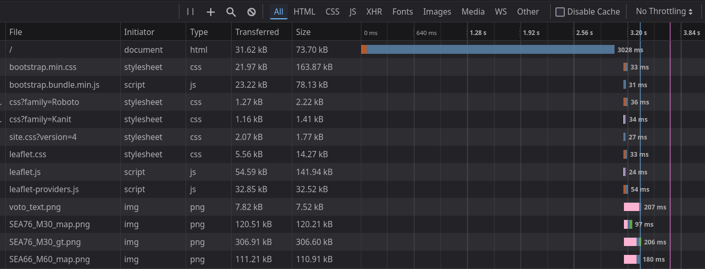
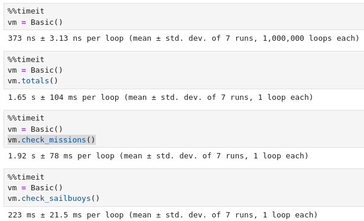
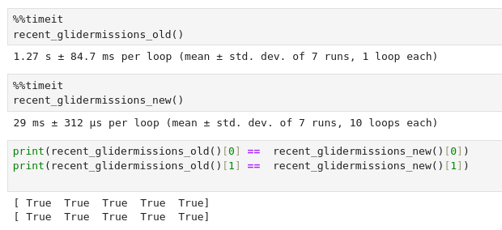
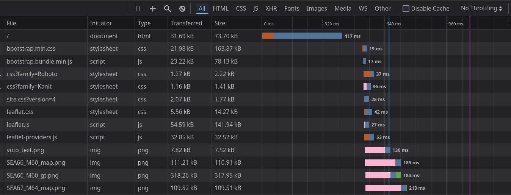

Title: Speeding up flask performance
Date: 2024-11-04 11:30
Modified: 2024-11-04 11:30
Category: FOSS
Tags: python, software, foss, automation, web, cache, tutorial, flask
Slug: flask_performant
Summary: How I went about profiling and optimising our data portal for a 4 X speedup of load times

# Summary
A worked example of how I reduced the page load on the VOTO observations portal from about 4 seconds to 1 second by improving use of the backend database and implementing a simple server-side cache.

Website stack: python, flask, mongodb, boostrap, leaflet maps, sellotape, prayers

Methods used: inspect element, firefox network profiler, ipython `%%timeit` function, decorators, json

Related articles: [Overview of python-flask with leaflet maps]({filename}/articles/flask_leaflet.md)

# Motivation

I have been aware for some time that the landing page of our [observations portal](https://observations.voiceoftheocean.org/) is painfully slow to load (around 4 seconds). This has steadily become worse as the total number of platforms we have deployed has grown, as has the database that must be queried when users visit this webpage. As various web-dev people will tell you, if your web page takes a long page to load, people will not visit it Also it seems pretty wasteful. A slow loading page is indicative of inefficiencies. We don't want to waste CPU cycles and be laughed at by other code slingers!

So how do we speed this up?

# Investigation

### Inspect web page

 First we need to find out which part of the request is causing the slow page load. To do this we inspect the web page with firefox Inspect Element (which is [not a crime](https://mango.pdf.zone/finding-former-australian-prime-minister-tony-abbotts-passport-number-on-instagram#were-not-done-just-because-a-web-page-says-were-done)) and do a hard refresh of the page (gotta clear out that browser cache). We can then check the "Network" tab to see how long various elements of the page took to load.

Here we can see that basically everything loads in milliseconds, except for the page itself index.html which takes over 3 seconds. This means that the slow performance is in the page, not loading other resources like the leaflet javascript library that drives the map or the images of near real time glider data. 



We also see that index.html is only 30 kB, so it is extremely unlikely that the slow load is due to transfer times. We can see png images 10 times as large loading in 200 ms.

### Profiling

Having established that it is the creation of the webpage that is the prime culprit, let's find the parts of the code that cause it. An admission: I've never used a real code profiler. There are many purpose built tools for such things, but for me, I've found it simpler to just paste the code into a jupyter notebook and run the magic `%%timeit` decorator on functions to track down where code is going slow. Let's have a look at the class Basic, which generates the html response to the user request.



Here we can see that the two methods `totals` and `check_missions` of the `Basic` class are the main causes of the slowdown, taking a whole 2.5 seconds between them. Let's try to speed up these methods.

# Fixing
### Method one: use the database properly

`totals` and `check_missions` are calling functions under the hood, `calculate_totals` and `recent_glidermissions`, both from the `voto.services.mission_service`. These functions both work by making a series of calls to the mongodb database and have big for loops. Here's `recent_glidermissions` before the fix:

```python
def recent_glidermissions_old(timespan=datetime.timedelta(hours=24), baltic_only=True):
    missions = GliderMission.objects()
    recent_gliders = []
    recent_missions = []
    for mission in missions:
        basin = mission.basin
        if baltic_only and not basin:
            continue
        since_last_dive = datetime.datetime.now() - mission.end
        if since_last_dive < timespan:
            recent_gliders.append(mission.glider)
            recent_missions.append(mission.mission)
    return recent_gliders, recent_missions
```

It grabs all the missions from the database (240 at time of writing), with all their metadata, then loops over them. It's just looking for missions which have an "end" (i.e. most recent data point) within the last 24 hours and are situated within the Baltic. It takes the glider number and mission number, appends those to lists, then returns those lists.

This works, but is highly inefficient! It's not an issue when you run it once during development (it takes just over a second) but when this is being run on **every visit to our home page** it adds up. Here's the code after optmising:


```python
def recent_glidermissions_new(timespan=datetime.timedelta(hours=24), baltic_only=True):  
    time_cut = datetime.datetime.now() - timespan  
    df = pd.DataFrame(  
        GliderMission.objects(end__gte=time_cut, basin__exists=baltic_only)  
        .only("mission", "glider")  
        .as_pymongo()  
    )  
    if df.empty:  
        return [], []  
    return df.glider, df.mission
```

Now, rather than grabbing all the missions from the database and looping over them, we have mongdb do the filtering. `end__gte` is how pymongo encodes Greater Than or Equal, i.e. >= our time cut of 24 hours ago. We also check if the mission has an assigned basin (that's how we know it's in the Baltic). We only return mission number and glider number, not all the fields for these missions, and we pass them to pandas to make a DataFrame from the list of dicts, rather than looping over the objects to extract these values. The new code is not only more concise, it is *40 times faster*.



We also run a check to reassure ourselves that the old function and the new one give the same results.

### Method two: Poor man's caching

The second function causing issues is `calculate_totals`. This is a long messy function that calculates a bunch of stats that managers love to see: number of gliders deplyed, total cumulative sea time, number of dives completed, horizontal and vertical distances travelled etc. Because these are stats across the whole database, it's much harder to find database efficiencies as we did for the recent glider missions function. But, as these are totals stats for the 4 + years of operation, they don't need to be updated every time a user refreshes the page! This seems like a good candidate for caching data.

I looked at a few built in methods, like Python's [functools.lru_cache](https://docs.python.org/3.9/library/functools.html#functools.lru_cache). This caches a return value for *n* calls, so the stats would be recalculated every time the *nth* page visit occurred. This didn't really fit my use case though, I want calculate these stats at a set interval, say once each day, not have the number of refreshes dependant on how frequently the page is visited. I thought of combining it with some cache intervention or cron job, but decided against it as I'd probably break something.

Then there are third party libraries like [cachetools](https://github.com/tkem/cachetools) which do have the capacity to set a time limit on cached items. But these contained warnings of thread safety, and I wasn't sure how this would interact with [uWSGI](https://uwsgi-docs.readthedocs.io/en/latest/) server that runs the website with multiple processes and threads. Also, I didn't want to add another external dependency if I could avoid it.

Instead I opted for a far simpler solution where I use a json file as storage. In pseudocode the solution is:

```python
def calculate_totals():
	stats = load_from_json(json_cache_file)
	if stats.time_edited > now - 24 hours:
		return stats
	else:
		...lots of stats calculations on the database...
		write_stats_to_json(json_cache_file)
		return stats
```

This way, we only re-calculate the stats once every 24 hours. There are various checks so that if e.g. the cache file doesn't exits, is corrupted, missing values or stale, the function runs as originally designed then writes to the cache file.

# Results

The main web page html loads in less than 500 ms! The total page load is just over 1 second. Not bad for an afternoon's work. We can now see that the pageload is comparable with the time it takes to load other assets, like the glider data plots and the map  tiles.



I'm sure there are more elegant and efficient ways I could have solved this, but these methods worked and took me an afternoon to investigate and implement.

### Why didn't I do this before? 

Mostly because it wasn't a problem before. When I started this website we had been operating for a year with far fewer gliders in the water. The database was smaller, the pages more basic and expectations were lower. Just having a publicly viewable map and some pngs of near real time data was a huge win! I'm also aware of the pitfalls of premature optimisation, where you put a lot of time into improving something that turns out not to be a critical application/performance bottleneck. Performance isn't something anyone has asked me about (does anyone really care that the page took 4 seconds to load?) But I think it's important to take a little professional pride in these things. 
# Reflection

- Speeding stuff up is very pleasing. But I'm sure after this I would soon hit marginal gains, having made the big savings of 75 % time cut with these two interventions.
- It's nice to have complete control over our data portal. Rather than needing to raise a ticket or kick the problem to another team I was able to remedy it myself in half a day. Though if we had a proper team of developers we probably wouldn't have shipped code with these performance flaws in the first place!
- There was no oceanography in this process. It would work for kind of any website with a similar stack and user needs. I'm increasingly spending my time more as a developer and server maintainer. I think I'm ok with that.
- I wrote this blog post while working on the problem, rather than after, to try to capture the process in the most accurate way possible. Inspired by the way [Julia Evans](https://jvns.ca/) writes her brilliant technical explainers.


