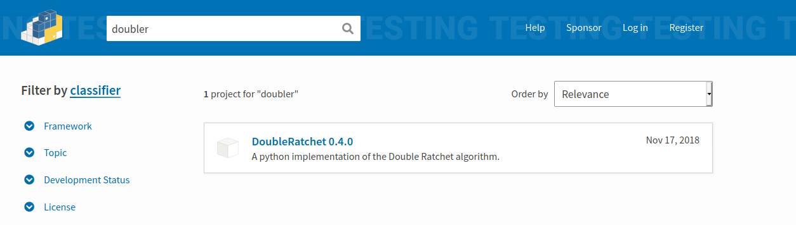
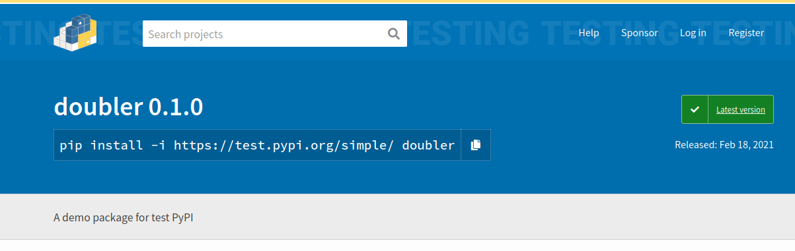

Title: Packaging Python
Date: 2021-02-17 21:00
Modified: 2021-02-17 21:00
Category: FOSS
Tags:  FOSS, Python, tutorial
Slug: packaging
Summary: How to package your Python code to PyPI and conda-forge

### The scenario

You've written a kick-ass Python script for solving your knotty scientific problem and you want to share it with your peers, great! How do you do this though? Sure, you could email it to interested parties like it's 1995, post it on twitter, or seed USBs loaded with code in strategic university car parks. There is, however, a far superior solution. Packaging.

 

Packaging is the art of wrapping your code up into a well defined, stand-alone form and distributing it over the Information Superhighway. Packaging allows you to distribute your code in a way that is

- Transparent
- Scalable
- Upgradable
- Easy to integrate

If you've coded more than a `hello world` in Python you've already used packages. When you interact with pip/conda environment or `import numpy as np` you are leveraging Python's extensive packaging ecosystem, standing on the shoulders of giants.

Wouldn't it be great if, when people inquired about your awesome code, you could tell that installing it is a simple as `pip install my_cool_package`?

Strap yourself in buddy, because in this tutorial, we're going to make that dream a reality.

### Prerequisites

- A basic understanding of the terminal, Python and git 
- An account on [GitHub](https://github.com/join)
- An account on [TestPyPI](https://test.pypi.org/account/register/)
- A cool script*


*for the purpose of this tutorial, a `hello world` is fine

### Disclaimers

1. **Surely this has been done before?** There are loads of other guides out there, check out *sources* at the bottom of this page for several of them. Other people have done it before and better. I'm only writing this because, when I created my first package, I couldn't find this info all in one place. Also PyPI went through a major revamp in 2017, so tutorials written before then can be very confusing.

2. **I did x and it didn't work/I got an error/my cat is now on fire.** You will very likely hit snags when following this tutorial with your own package. All code is unique, search engines are your friend, but feel free to email me if you get stuck!

3. **Is this hard to do/will people laugh at me if I lack mad hacker skillz?** No! The FOSS community is far from perfect, but everyone has they're first time doing this stuff. Your merges will screw up the codebase, your CI checks will fail, your package will ship with half the parts missing. This is fine. In software, failure is cheap and part of learning.

# Let's go!


You start off with a script. A beautiful script. Maybe it does something super useful like doubling a number. In a script called `bignumber.py`, you have a function:

```python
def double_number(input):
	return 2 * input
```

This is some pretty complex stuff, so we'll include a markdown file, `README.md`, so readers can get the précis of our project:

README.md
```
# Doubler

This package is for a function that doubles your numbers, making them twice as good.

[website here](www.doubler-documentation.com)

```

[*Hold up, what's markdown?*](https://www.markdownguide.org/cheat-sheet/)

We create a **directory** for our script. This will be the name of the package, so check that it's not already taken on PyPI. I'm using the name doubler.

 

We put the script `bignumber.py` in this directory, and add another file called `__init__.py` next to it. This file will enable our directory to be imported as a module later.

__init__.py
```python
from __future__ import absolute_import
from . import doubler


__authors__ = ['Callum Rollo <c.rollo@outlook.com>']

__version__ = "0.0.1"
```

We'll want a licence too, go and grab one from [opensource.org](https://opensource.org/licenses). In this case I've gone with the simple and permissive MIT license. Just dump the text into a file called LICENSE in the base directory, adding your name and the current year at the top. The license is what makes this a rad open source project that other people are free to remix. Code posted without a license will default to being your private intellectual property, which isn't rad at all.

After all this we have the following structure:
```shell
packaging-dir  (this directory name doesn't matter)
├── doubler (your package name)
│   ├── __init__.py
│   └── bignumber.py (the actual code)
├── LICENSE
├── README.md
└── setup.py (explained in the next section)
```

### Put your project on github

Now is as good a time as any. You can point the github repo in the README so people know where to go if they have bug reports or improvements for your code. Don't forget to commit regularly!

### Add setup.py

We'll need some boilerplate in **setup.py**. This contains the human and machine readable information on our package. This is essential for the ship to PyPI, so check you get the info right.

setup.py:
```python
import setuptools

with open("README.md", "r", encoding="utf-8") as fh:
    long_description = fh.read()

setuptools.setup(
    name="doubler",
    version="0.0.1",
    author="Callum Rollo",
    author_email="c.rollo@outlook.com",
    description="A demo package for test PyPI",
    long_description=long_description,
    long_description_content_type="text/markdown",
    url="https://github.com/callumrollo/doubler",
    classifiers=[
        "Programming Language :: Python :: 3",
        "License :: OSI Approved :: MIT License",
        "Operating System :: OS Independent",
    ],
    packages=setuptools.find_packages(),
    python_requires='>=3.6',
)
```
You'll find detail on all these in this [python.org article](https://packaging.python.org/tutorials/packaging-projects/#packaging-your-project).

Now, we package the code using **setuptools**. If you haven't got it installed it already, it's on pip and conda-forge. From the command line in the package base directory (packaging-dir in this case), run:

`python setup.py sdist`

This will create a directory `dist` that contains a tar archive of your packaged code. You will notice that the name of this archive is named using the `name` and `version` fields from setup.py.


### Shipping to PyPI

Now that we've made out package, we want to put it somewhere everyone can access it. The most popular site for Python packages as PyPI. When we're starting out however, it's best to use the sandbox test PyPI, which works exactly like the real PyPI but is a safe place to make mistakes while we practice.


You ship the package to test-PyPI with `twine`, this is also availble via pip and conda.

`python -m twine upload  dist/* --repository testpypi`

And that's it! Go check out your work on test.pypi.org

 


You can now install your package anywhere in the world with

`pip install -i https://test.pypi.org/simple/ doubler==0.0.1`

Once that works, do it for real on pyPI by dropping the --repository testpypi.

For (test)PyPI to accept your package, you'll need the correct credentials. You can type these in the command line each time you upload your package, or add them to a  file called **.pypirc** in your home folder:

```shell
[distutils]
index-servers=
    testpypi
    pypi

[testpypi]
repository = https://testpypi.python.org/pypi
username = <account_name>
password = <account_password>

[pypi]
repository = https://test.pypi.org/legacy/
username = <account_name>
password = <account_password>
```

Just change the stuff in the angle brackets. You probably shouldn't [reuse your password](https://xkcd.com/792/).

### Shipping to conda-forge

[Conda-forge](https://conda-forge.org/) is the community run package repository that is fully compatible with conda core but way bigger. Conda-forge packages build from from PyPI packages which is why we PyPI first. Conda-forge packages (called recipes) are managed through github, so you'll need to be familiar with creating pull requests.

Adding a package to conda-forge is a little tricker, as it will need to be approved by a moderator. This gives your project a big visibility boost though, especially among scientists. Also scrutiny of your code is a good thing! Conda-forge admins will check that you have things like a valid open source license and functioning tests before your package is distributed.

The process for adding a recipe to conda-forge is outlined on their [website](https://conda-forge.org/#add_recipe). The core action is creating a pull request on conda-forge/staged recipes that points to your PyPI package and contains key information on build requirements.


### Updating

To update your PyPI package, you need to update to a higher version number, otherwise the tarball you make will have the same name and PyPI will reject it. Note that you need to update the version number in `setup.py` and `__init__.py`.

What version number should I go to? I like [semantic versioning](https://semver.org/). Other sytems are fine too, just be consistent.


Updating on conda-forge is simple. You fork the feedstock to your git hub account, bump the version number in recipe/meta.yaml


Remember to change the SHAsum too, (you can find this on the PyPI download page in Downloads >> hashes) or the CI checks will fail.

There are good instructions on this in the README of the feedstock itself.

In short, you need to:

- Create a branch on the feedstock from your own fork
- Update the SHAsum to correspond to that on pypi
- re-render the feedstock


### How about a real package?

Copy the structure of something similar if you can. The first package I made for PyPI was a series of colourmaps, so I based it off the excellent [cmocean](https://github.com/matplotlib/cmocean). I would advise pushing to git and getting a package on test-PyPI early in development, so you can make all the early packaging mistakes before going to PyPI official.

Write down your process! It will save you a world of pain when you need to update the package a year later.


### Sources

https://packaging.python.org/tutorials/packaging-projects/#packaging-your-project

https://blog.jonasneubert.com/2017/09/13/publishing-your-first-pypi-package/

https://blog.jetbrains.com/pycharm/2017/05/how-to-publish-your-package-on-pypi/

https://conda-forge.org/docs/maintainer/00_intro.html

### Acronyms and terminology TODO

- **CI** Contiuouns Integration. When we push code to github we have automated tests and linting.
- **Shipping** to upload code to the public (not to be confused with frieght forwarding or fanfic)


